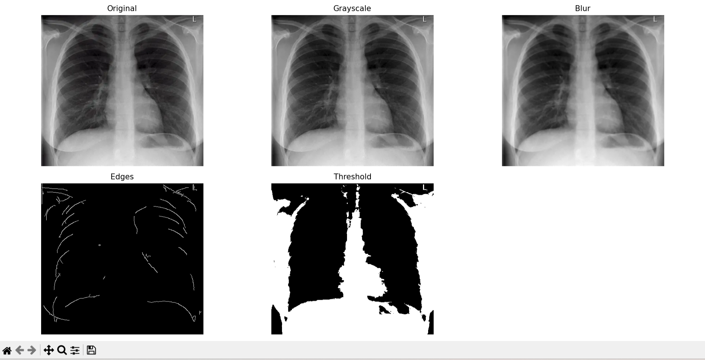

# Medical Image Processing using OpenCV

This project demonstrates a basic medical image processing pipeline applied to chest X-ray images using Python and OpenCV.

## 🔧 Techniques Implemented
- Grayscale Conversion
- Gaussian Blur (Noise Reduction)
- Edge Detection (Canny)
- Image Segmentation (Thresholding)

## 📊 Project Workflow
1. Input X-ray image  
2. Convert to grayscale  
3. Apply noise reduction  
4. Detect edges  
5. Segment image  

## 📸 Output
The following outputs are generated:
- Original Image
- Grayscale Image
- Blurred Image
- Edge Detection Output
- Threshold Segmented Image

## 🛠 Technologies Used
- Python
- OpenCV
- NumPy
- Matplotlib

## 🚀 Future Scope
- Apply machine learning for disease detection  
- Improve segmentation using advanced techniques  
- Work with real medical datasets  

## 📌 Author
Durgam Siddartha

